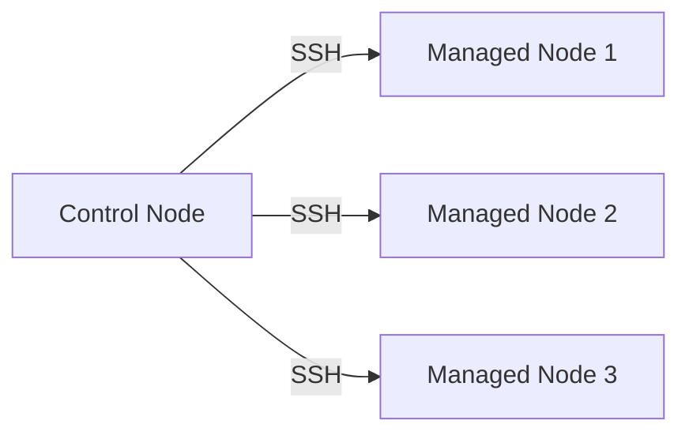
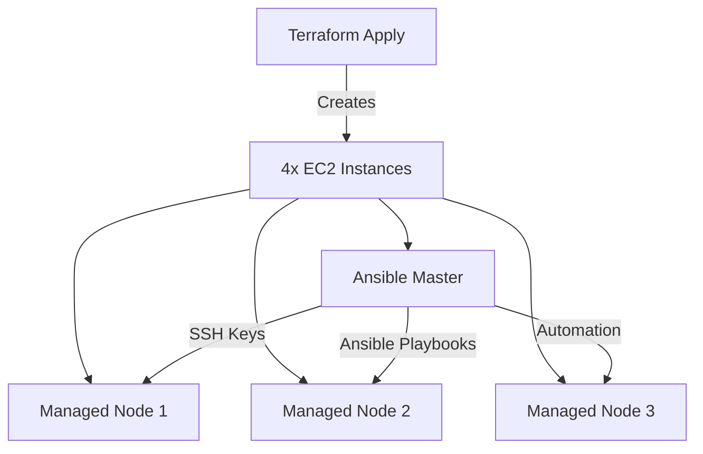

# **🚀 Ansible Automation Mastery: Infrastructure as Code with Terraform & Ansible**  
*A Comprehensive Guide to Setting Up Ansible on AWS EC2 with Terraform Provisioning*  

---

## **📌 Table of Contents**  
1. [**Introduction to Ansible**](#-introduction-to-ansible)  
2. [**Why Use Ansible?**](#-why-use-ansible)
3. [**Local Installation Guide**](#-local-installation-guide) 
4. [**Lab Setup: Terraform + AWS EC2**](#-lab-setup-terraform--aws-ec2)  
5. [**Ansible Installation & Configuration**](#-ansible-installation--configuration)  
6. [**Ansible Inventory & Host Management**](#-ansible-inventory--host-management)  
7. [**Verification & Testing**](#-verification--testing)  
8. [**Next Steps & Advanced Automation**](#-next-steps--advanced-automation)  
9. [**Visual Workflow Diagram**](#-visual-workflow-diagram)  

---

## **🤖 Introduction to Ansible**  
**Ansible** is an open-source **automation engine** that simplifies:  
✅ **Configuration Management** (Consistent server setups)  
✅ **Application Deployment** (CI/CD pipelines)  
✅ **Orchestration** (Multi-tier workflows)  
✅ **Security & Compliance** (Automated hardening)  

🔹 **Agentless** → Uses **SSH/WinRM** (No extra software on nodes).  
🔹 **Idempotent** → Safe to rerun (No unintended side effects).  
🔹 **YAML-Based** → Easy-to-write **playbooks**.  

---

## **⚡ Why Use Ansible?**  
| **Feature** | **Traditional Approach** | **Ansible Approach** |
|------------|------------------------|---------------------|
| **Deployment Speed** | Manual, Slow | Automated, Fast |
| **Error-Prone?** | High (Human mistakes) | Low (Consistent automation) |
| **Scalability** | Difficult (Manual configs) | Easy (Reusable playbooks) |
| **Security** | Inconsistent | Enforced via automation |

💡 **Use Case**: Automate **web server deployments**, **database setups**, **cloud provisioning**, and **security patches** with minimal effort.  

### **How Ansible Works**  


---

## 💻 **Local Installation Guide**  

### **Linux Installation**  
```bash
# Ubuntu/Debian
sudo apt update
sudo apt install ansible -y

# RHEL/CentOS
sudo yum install ansible -y

# Verify
ansible --version
```

### **macOS Installation**  
```bash
# Using Homebrew
brew install ansible

# Verify
ansible --version
```

### **Windows (WSL) Installation**  
1. Install WSL:  
   ```powershell
   wsl --install
   ```
2. Install Ubuntu from Microsoft Store  
3. Open WSL and run:  
   ```bash
   sudo apt update && sudo apt install ansible -y
   ```

---

## **🛠 Lab Setup: Terraform + AWS EC2**  
### **🔹 Step 1: Terraform for EC2 Provisioning**  
We’ll deploy **4 instances** (1 Ansible Master + 3 Managed Nodes). 

---


---


#### **`main.tf`**  
```hcl
# Ansible Master Node
resource "aws_instance" "ansible_master" {
  ami           = "ami-0c55b159cbfafe1f0" # Ubuntu 20.04
  instance_type = "t2.micro"
  key_name      = "terra-key-ansible"
  tags = { Name = "Ansible-Control-Node" }
}

# Managed Nodes (3x)
resource "aws_instance" "managed_nodes" {
  count         = 3
  ami           = "ami-0c55b159cbfafe1f0"
  instance_type = "t2.micro"
  key_name      = "terra-key-ansible"
  tags = { Name = "Managed-Node-${count.index + 1}" }
}
```

#### **🔸 Apply Terraform**  
```bash
terraform init
terraform plan
terraform apply -auto-approve
```

---

## **📥 Ansible Installation & Configuration**  
### **🔹 Step 2: Install Ansible on Master Node**  
```bash
# Update & Install Ansible
sudo apt update && sudo apt install -y ansible

# Verify Installation
ansible --version
```
✅ **Expected Output**:  
```
ansible [core 2.12.x]
  config file = /etc/ansible/ansible.cfg
  python version = 3.8.10
```


---

## **📂 Ansible Inventory & Host Management**  
### **🔹 Step 3: Configure Hosts & SSH Keys**  
```bash
mkdir -p ~/keys && chmod 700 ~/keys
vim ~/keys/terra-key-ansible.pem  # Paste your private key
chmod 400 ~/keys/terra-key-ansible.pem
```

### **🔹 Step 4: Modify `/etc/ansible/hosts`**  
```ini
[web_servers]
web1 ansible_host=<IP1>
web2 ansible_host=<IP2>
web3 ansible_host=<IP3>

[web_servers:vars]
ansible_user=ubuntu
ansible_python_interpreter=/usr/bin/python3
ansible_ssh_private_key_file=/home/ubuntu/keys/terra-key-ansible.pem
```


---

## **✔ Verification & Testing**  
### **🔹 Check Inventory**  
```bash
ansible-inventory --list --yaml
```
**Output**:  
```yaml
all:
  children:
    web_servers:
      hosts:
        web1: { ansible_host: 10.0.1.10 }
        web2: { ansible_host: 10.0.1.11 }
        web3: { ansible_host: 10.0.1.12 }
```


### **🔹 Test Connectivity**  
```bash
ansible all -m ping
```
✅ **Success Response**:  
```
web1 | SUCCESS => { "ping": "pong" }
web2 | SUCCESS => { "ping": "pong" }
web3 | SUCCESS => { "ping": "pong" }
```

---

## **🚀 Next Steps & Advanced Automation**  
📌 **Ad-Hoc Commands**  
```bash
ansible all -a "free -h"  # Check memory
ansible all -a "df -h"    # Check disk space
```

📌 **Create Your First Playbook** (`deploy_nginx.yml`)  
```yaml
---
- name: Install & Start Nginx
  hosts: web_servers
  tasks:
    - name: Install Nginx
      apt: name=nginx state=present
    - name: Start Nginx
      service: name=nginx state=started
```
▶ **Run Playbook**:  
```bash
ansible-playbook deploy_nginx.yml
```

---

## **📊 Visual Workflow Diagram**  


---

## **🔗 Resources**  
📚 [Ansible Documentation](https://docs.ansible.com/)  
📚 [Terraform AWS Provider](https://registry.terraform.io/providers/hashicorp/aws/latest/docs)  
📚 [Ansible Galaxy (Pre-built Roles)](https://galaxy.ansible.com/)  

---

### **🎯 Key Takeaways**  
✔ **Infrastructure as Code (IaC)** → Terraform + Ansible = **Full Automation**  
✔ **Agentless & Scalable** → Manage **100s of servers** with minimal setup.  
✔ **YAML Simplicity** → No complex scripting needed.  

🚀 **Now go automate everything!** 🚀
